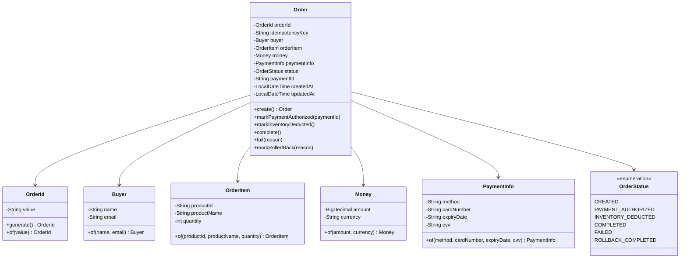

# 微服務訂單系統 MVP

基於 SAGA 編排模式的微服務訂單系統，採用領域驅動設計（DDD）與六角形架構。

## 目錄

- [系統架構](#系統架構)
- [技術棧](#技術棧)
- [快速開始](#快速開始)
- [服務說明](#服務說明)
- [類別圖](#類別圖)
- [循序圖](#循序圖)
- [ER Diagram](#er-diagram)
- [API 清單](#api-清單)
- [Swagger 文件](#swagger-文件)
- [測試案例](#測試案例)
- [BDD Gherkin 規格](#bdd-gherkin-規格)
- [H2 資料庫使用教學](#h2-資料庫使用教學)

---

## 系統架構

### 整體架構


### 六角形架構（單一服務）


### SAGA 流程狀態機


### 架構特點

- **領域驅動設計 (DDD)**：每個服務有獨立的限界上下文
- **六角形架構**：端口與適配器模式，業務邏輯與基礎設施分離
- **SAGA 編排模式**：同步編排式分散式交易
- **CQRS**：命令與查詢責任分離

---

## 技術棧

| 類別 | 技術 |
|------|------|
| 語言 | Java 17 |
| 框架 | Spring Boot 3.2.1 |
| 建構工具 | Gradle 8.5 |
| 資料庫 | H2 (開發)、PostgreSQL (生產) |
| API 文件 | OpenAPI 3.0 / Swagger UI |
| 測試 | JUnit 5、Cucumber (BDD) |

---

## 快速開始

### 前置需求

- Java 17+
- Gradle 8.x (或使用 Gradle Wrapper)

### 啟動服務

```bash
# 進入專案目錄
cd order-system

# 編譯專案
./gradlew build -x test

# 啟動三個服務（在不同終端機）
./gradlew :inventory-service:bootRun  # Port 8083
./gradlew :payment-service:bootRun    # Port 8082
./gradlew :order-service:bootRun      # Port 8081
```

### 測試 API

```bash
# 建立訂單（成功案例）
curl -X POST http://localhost:8081/api/v1/orders \
  -H "Content-Type: application/json" \
  -H "X-Idempotency-Key: test-001" \
  -d '{
    "buyer": {"name": "王小明", "email": "ming@example.com"},
    "orderItem": {"productId": "IPHONE-17-PRO-MAX", "productName": "iPhone 17 Pro Max", "quantity": 1},
    "payment": {"method": "CREDIT_CARD", "amount": 35900, "currency": "TWD", "cardNumber": "4111111111111111", "expiryDate": "12/26", "cvv": "123"}
  }'

# 預期回應
# {"orderId":"ORD-XXXXXXXX","status":"COMPLETED","message":"訂購成功","createdAt":"..."}
```

---

## 服務說明

### Order Service (Port 8081)

訂單服務，負責訂單生命週期管理與 SAGA 編排。

| 職責 | 說明 |
|------|------|
| 訂單建立 | 接收訂單請求，啟動 SAGA 流程 |
| SAGA 編排 | 協調 Payment 與 Inventory 服務 |
| 訂單查詢 | 提供訂單狀態查詢 |
| 冪等性處理 | 透過 idempotency key 避免重複建立 |

### Payment Service (Port 8082)

支付服務，負責支付授權、請款與取消。

| 職責 | 說明 |
|------|------|
| 支付授權 | 預授權扣款 |
| 支付請款 | 確認扣款 |
| 支付取消 | 取消授權（補償操作） |

### Inventory Service (Port 8083)

庫存服務，負責庫存管理。

| 職責 | 說明 |
|------|------|
| 庫存扣減 | 扣減商品庫存 |
| 庫存回滾 | 回滾已扣減庫存（補償操作） |

---

## 類別圖

### Order Service 領域模型



### Payment Service 領域模型


### Inventory Service 領域模型


---

## 循序圖

### 成功案例：建立訂單


### 失敗案例 1：支付授權失敗


### 失敗案例 2：庫存不足（需補償）


### 失敗案例 3：請款失敗（完整補償）


---

## ER Diagram

### Order Service 資料模型


### Payment Service 資料模型


### Inventory Service 資料模型


---

## API 清單

### Order Service API

| Method | Endpoint | 說明 |
|--------|----------|------|
| POST | `/api/v1/orders` | 建立訂單 |
| GET | `/api/v1/orders/{orderId}` | 查詢訂單 |

#### POST /api/v1/orders

**Request Headers:**
```
Content-Type: application/json
X-Idempotency-Key: {unique-key}  (選填)
```

**Request Body:**
```json
{
  "buyer": {
    "name": "王小明",
    "email": "ming@example.com"
  },
  "orderItem": {
    "productId": "IPHONE-17-PRO-MAX",
    "productName": "iPhone 17 Pro Max",
    "quantity": 1
  },
  "payment": {
    "method": "CREDIT_CARD",
    "amount": 35900,
    "currency": "TWD",
    "cardNumber": "4111111111111111",
    "expiryDate": "12/26",
    "cvv": "123"
  }
}
```

**Response (201 Created):**
```json
{
  "orderId": "ORD-A1B2C3D4",
  "status": "COMPLETED",
  "message": "訂購成功",
  "createdAt": "2026-01-12T20:50:00"
}
```

#### GET /api/v1/orders/{orderId}

**Response (200 OK):**
```json
{
  "orderId": "ORD-A1B2C3D4",
  "status": "COMPLETED",
  "buyer": {
    "name": "王小明",
    "email": "ming@example.com"
  },
  "orderItem": {
    "productId": "IPHONE-17-PRO-MAX",
    "productName": "iPhone 17 Pro Max",
    "quantity": 1
  },
  "totalAmount": {
    "amount": 35900.00,
    "currency": "TWD"
  },
  "paymentId": "PAY-X1Y2Z3W4",
  "createdAt": "2026-01-12T20:50:00",
  "updatedAt": "2026-01-12T20:50:01"
}
```

### Payment Service API

| Method | Endpoint | 說明 |
|--------|----------|------|
| POST | `/api/v1/payments/authorize` | 支付授權 |
| POST | `/api/v1/payments/capture` | 支付請款 |
| POST | `/api/v1/payments/void` | 取消授權 |

### Inventory Service API

| Method | Endpoint | 說明 |
|--------|----------|------|
| POST | `/api/v1/inventory/deduct` | 扣減庫存 |
| POST | `/api/v1/inventory/rollback` | 回滾庫存 |

---

## Swagger 文件

各服務啟動後，可透過以下網址存取 Swagger UI：

| 服務 | Swagger UI | API Docs |
|------|------------|----------|
| Order Service | http://localhost:8081/swagger-ui.html | http://localhost:8081/api-docs |
| Payment Service | http://localhost:8082/swagger-ui.html | http://localhost:8082/api-docs |
| Inventory Service | http://localhost:8083/swagger-ui.html | http://localhost:8083/api-docs |

### Swagger UI 截圖範例

存取 http://localhost:8081/swagger-ui.html 可查看：
- 所有 API 端點清單
- Request/Response Schema
- 線上測試 API 功能

---

## 測試案例

### 測試卡號規則

| 卡號開頭 | 行為 |
|----------|------|
| `4111` | 授權成功 |
| `4000` | 授權失敗（餘額不足） |
| `5000` | 授權成功，請款失敗 |

### 手動測試案例

#### 案例 1：成功建立訂單
```bash
curl -X POST http://localhost:8081/api/v1/orders \
  -H "Content-Type: application/json" \
  -H "X-Idempotency-Key: success-test-001" \
  -d '{
    "buyer": {"name": "測試用戶", "email": "test@example.com"},
    "orderItem": {"productId": "IPHONE-17-PRO-MAX", "productName": "iPhone 17 Pro Max", "quantity": 1},
    "payment": {"method": "CREDIT_CARD", "amount": 35900, "currency": "TWD", "cardNumber": "4111111111111111", "expiryDate": "12/26", "cvv": "123"}
  }'

# 預期：status=COMPLETED, message=訂購成功
```

#### 案例 2：支付授權失敗
```bash
curl -X POST http://localhost:8081/api/v1/orders \
  -H "Content-Type: application/json" \
  -H "X-Idempotency-Key: payment-fail-001" \
  -d '{
    "buyer": {"name": "測試用戶", "email": "test@example.com"},
    "orderItem": {"productId": "IPHONE-17-PRO-MAX", "productName": "iPhone 17 Pro Max", "quantity": 1},
    "payment": {"method": "CREDIT_CARD", "amount": 35900, "currency": "TWD", "cardNumber": "4000111122223333", "expiryDate": "12/26", "cvv": "123"}
  }'

# 預期：status=FAILED, message=支付失敗
```

#### 案例 3：庫存不足
```bash
curl -X POST http://localhost:8081/api/v1/orders \
  -H "Content-Type: application/json" \
  -H "X-Idempotency-Key: inventory-fail-001" \
  -d '{
    "buyer": {"name": "測試用戶", "email": "test@example.com"},
    "orderItem": {"productId": "IPHONE-17-PRO-MAX", "productName": "iPhone 17 Pro Max", "quantity": 9999},
    "payment": {"method": "CREDIT_CARD", "amount": 35900, "currency": "TWD", "cardNumber": "4111111111111111", "expiryDate": "12/26", "cvv": "123"}
  }'

# 預期：status=ROLLBACK_COMPLETED, message=庫存扣減失敗
```

#### 案例 4：冪等性測試
```bash
# 第一次請求
curl -X POST http://localhost:8081/api/v1/orders \
  -H "Content-Type: application/json" \
  -H "X-Idempotency-Key: idempotency-test-001" \
  -d '{...}'

# 第二次請求（相同 idempotency key）
curl -X POST http://localhost:8081/api/v1/orders \
  -H "Content-Type: application/json" \
  -H "X-Idempotency-Key: idempotency-test-001" \
  -d '{...}'

# 預期：兩次回應相同的 orderId
```

---

## BDD 行為驅動開發

### 什麼是 BDD？

**行為驅動開發（Behavior-Driven Development, BDD）** 是一種敏捷軟體開發方法論，強調開發人員、QA 和非技術人員之間的協作溝通。


### BDD 核心原則

| 原則 | 說明 |
|------|------|
| **共同語言** | 使用 Gherkin 語法讓所有人都能理解需求 |
| **由外而內** | 從使用者行為出發，而非技術實作 |
| **活文件** | 測試即文件，規格永遠與程式碼同步 |
| **三方協作** | 業務、開發、QA 共同定義驗收標準 |

### Gherkin 語法說明

Gherkin 是一種領域特定語言（DSL），用於描述軟體行為：

```gherkin
# language: zh-TW
功能: 功能名稱
  作為 [角色]
  我希望 [目標]
  以便 [獲得的價值]

  背景:
    假設 [前置條件]

  場景: 場景名稱
    假設 [給定的前置條件]
    當 [執行的動作]
    那麼 [預期的結果]
```

| 關鍵字 | 英文 | 用途 |
|--------|------|------|
| 功能 | Feature | 描述測試的功能模組 |
| 背景 | Background | 所有場景共用的前置條件 |
| 場景 | Scenario | 一個具體的測試案例 |
| 假設 | Given | 設定前置條件 |
| 當 | When | 執行動作 |
| 那麼 | Then | 驗證結果 |
| 並且 | And | 連接多個步驟 |

### BDD 工作流程


---

## 本專案 BDD 測試案例

本專案使用 **Cucumber** 框架實作 BDD 測試，測試檔案位於：
```
order-system/e2e-tests/src/test/resources/features/
```

### 測試案例總覽

| Feature 檔案 | 功能 | 場景數 | 正向 | 反向 |
|--------------|------|--------|------|------|
| `order_creation.feature` | 訂單建立流程 | 7 | 2 | 5 |
| `inventory_management.feature` | 庫存管理流程 | 6 | 4 | 2 |
| `payment_processing.feature` | 支付處理流程 | 6 | 2 | 4 |
| **總計** | | **19** | **8** | **11** |

---

### Feature 1: 訂單建立流程

```gherkin
# language: zh-TW
@order
功能: 訂單建立流程
  作為一個電商平台
  我希望能處理客戶的訂單
  以便完成商品銷售

  背景:
    假設 系統中有商品 "IPHONE-17" 庫存為 10 件
    並且 支付服務正常運作

  @positive @happy-path
  場景: 成功建立訂單
    假設 買家 "王小明" 的電子郵件為 "ming@example.com"
    並且 購買商品 "IPHONE-17" 數量為 1 件
    並且 使用信用卡 "4111111111111111" 有效期 "12/26" CVV "123" 支付 35900 元
    當 買家提交訂單
    那麼 訂單應建立成功
    並且 訂單狀態應為 "COMPLETED"
    並且 支付狀態應為 "CAPTURED"
    並且 庫存應扣減至 9 件

  @positive
  場景: 多件商品訂單成功建立
    假設 買家 "李四" 的電子郵件為 "li@example.com"
    並且 購買商品 "IPHONE-17" 數量為 3 件
    並且 使用信用卡 "4111111111111111" 有效期 "12/26" CVV "123" 支付 107700 元
    當 買家提交訂單
    那麼 訂單應建立成功
    並且 訂單狀態應為 "COMPLETED"
    並且 庫存應扣減至 7 件

  @negative @payment-failure
  場景: 支付授權失敗時訂單應標記為失敗
    假設 買家 "張三" 的電子郵件為 "zhang@example.com"
    並且 購買商品 "IPHONE-17" 數量為 1 件
    並且 使用信用卡 "4000000000000002" 有效期 "12/26" CVV "123" 支付 35900 元
    並且 支付授權將會失敗並返回 "Card declined"
    當 買家提交訂單
    那麼 訂單應建立失敗
    並且 訂單狀態應為 "FAILED"
    並且 失敗原因應包含 "Card declined"
    並且 庫存應維持為 10 件

  @negative @insufficient-stock
  場景: 庫存不足時訂單應失敗並取消支付
    假設 買家 "王小明" 的電子郵件為 "ming@example.com"
    並且 購買商品 "IPHONE-17" 數量為 15 件
    並且 使用信用卡 "4111111111111111" 有效期 "12/26" CVV "123" 支付 538500 元
    當 買家提交訂單
    那麼 訂單應建立失敗
    並且 訂單狀態應為 "ROLLED_BACK"
    並且 失敗原因應包含 "Insufficient stock"
    並且 支付授權應已取消
    並且 庫存應維持為 10 件

  @negative @capture-failure
  場景: 請款失敗時應執行補償交易
    假設 買家 "陳大文" 的電子郵件為 "chen@example.com"
    並且 購買商品 "IPHONE-17" 數量為 1 件
    並且 使用信用卡 "4111111111111111" 有效期 "12/26" CVV "123" 支付 35900 元
    並且 請款將會失敗並返回 "Capture timeout"
    當 買家提交訂單
    那麼 訂單應建立失敗
    並且 訂單狀態應為 "ROLLED_BACK"
    並且 失敗原因應包含 "Capture timeout"
    並且 庫存應已回滾至 10 件
    並且 支付授權應已取消

  @negative @invalid-card
  場景: 無效信用卡格式應返回驗證錯誤
    假設 買家 "測試用戶" 的電子郵件為 "test@example.com"
    並且 購買商品 "IPHONE-17" 數量為 1 件
    並且 使用信用卡 "1234" 有效期 "12/26" CVV "123" 支付 35900 元
    當 買家提交訂單
    那麼 應返回驗證錯誤
    並且 錯誤訊息應包含 "Invalid card number"

  @negative @product-not-found
  場景: 商品不存在時應返回錯誤
    假設 買家 "王小明" 的電子郵件為 "ming@example.com"
    並且 購買商品 "NON-EXISTENT" 數量為 1 件
    並且 使用信用卡 "4111111111111111" 有效期 "12/26" CVV "123" 支付 35900 元
    當 買家提交訂單
    那麼 訂單應建立失敗
    並且 失敗原因應包含 "Product not found"
```

---

### Feature 2: 庫存管理流程

```gherkin
# language: zh-TW
@inventory
功能: 庫存管理流程
  作為一個庫存系統
  我希望能正確管理商品庫存
  以便確保訂單履行的準確性

  背景:
    假設 商品 "IPHONE-17" 名稱為 "iPhone 17 Pro Max" 初始庫存為 100 件

  @positive
  場景: 成功扣減庫存
    當 為訂單 "ORD-12345678" 扣減商品 "IPHONE-17" 數量 5 件
    那麼 扣減應成功
    並且 商品 "IPHONE-17" 庫存應為 95 件

  @positive
  場景: 成功回滾庫存
    假設 已為訂單 "ORD-12345678" 扣減商品 "IPHONE-17" 數量 5 件
    當 為訂單 "ORD-12345678" 回滾商品 "IPHONE-17" 數量 5 件
    那麼 回滾應成功
    並且 商品 "IPHONE-17" 庫存應為 100 件

  @negative
  場景: 庫存不足時扣減失敗
    當 為訂單 "ORD-99999999" 扣減商品 "IPHONE-17" 數量 150 件
    那麼 扣減應失敗
    並且 失敗原因應包含 "Insufficient stock"
    並且 商品 "IPHONE-17" 庫存應維持 100 件

  @negative
  場景: 商品不存在時扣減失敗
    當 為訂單 "ORD-12345678" 扣減商品 "NON-EXISTENT" 數量 1 件
    那麼 扣減應失敗
    並且 失敗原因應包含 "Product not found"

  @positive @idempotent
  場景: 重複扣減請求應具備冪等性
    當 為訂單 "ORD-IDEM0001" 扣減商品 "IPHONE-17" 數量 2 件
    並且 再次為訂單 "ORD-IDEM0001" 扣減商品 "IPHONE-17" 數量 2 件
    那麼 兩次扣減都應成功
    並且 商品 "IPHONE-17" 庫存應為 98 件
    並且 只應有一筆扣減記錄

  @positive @concurrent
  場景: 並發扣減應正確處理
    當 同時有 3 個訂單各扣減商品 "IPHONE-17" 數量 10 件
    那麼 所有扣減都應成功
    並且 商品 "IPHONE-17" 庫存應為 70 件
```

---

### Feature 3: 支付處理流程

```gherkin
# language: zh-TW
@payment
功能: 支付處理流程
  作為一個支付系統
  我希望能安全地處理各種支付情境
  以便確保交易的完整性

  @positive
  場景: 成功授權並請款
    假設 有效的支付請求金額為 35900 元幣別為 "TWD"
    並且 信用卡號為 "4111111111111111" 有效期為 "12/26" CVV 為 "123"
    當 執行支付授權
    那麼 授權應成功
    並且 應返回支付編號
    當 執行請款
    那麼 請款應成功
    並且 支付狀態應為 "CAPTURED"

  @positive
  場景: 成功取消授權
    假設 有效的支付請求金額為 50000 元幣別為 "TWD"
    並且 信用卡號為 "4111111111111111" 有效期為 "12/26" CVV 為 "123"
    當 執行支付授權
    那麼 授權應成功
    當 取消支付授權
    那麼 取消應成功
    並且 支付狀態應為 "VOIDED"

  @negative
  場景: 餘額不足時授權失敗
    假設 有效的支付請求金額為 1000000 元幣別為 "TWD"
    並且 信用卡號為 "4000000000000002" 有效期為 "12/26" CVV 為 "123"
    當 執行支付授權
    那麼 授權應失敗
    並且 失敗原因應為 "Insufficient funds"

  @negative
  場景: 卡片過期時授權失敗
    假設 有效的支付請求金額為 35900 元幣別為 "TWD"
    並且 信用卡號為 "4111111111111111" 有效期為 "01/20" CVV 為 "123"
    當 執行支付授權
    那麼 授權應失敗
    並且 失敗原因應為 "Card expired"

  @negative
  場景: CVV 錯誤時授權失敗
    假設 有效的支付請求金額為 35900 元幣別為 "TWD"
    並且 信用卡號為 "4111111111111111" 有效期為 "12/26" CVV 為 "999"
    當 執行支付授權
    那麼 授權應失敗
    並且 失敗原因應為 "Invalid CVV"

  @negative
  場景: 重複請款應失敗
    假設 有效的支付請求金額為 35900 元幣別為 "TWD"
    並且 信用卡號為 "4111111111111111" 有效期為 "12/26" CVV 為 "123"
    當 執行支付授權
    並且 執行請款
    當 再次執行請款
    那麼 請款應失敗
    並且 失敗原因應為 "Payment already captured"
```

---

### 執行 BDD 測試

```bash
# 進入專案目錄
cd order-system

# 執行所有 BDD 測試
./gradlew :e2e-tests:test

# 執行特定標籤的測試
./gradlew :e2e-tests:test -Dcucumber.filter.tags="@positive"
./gradlew :e2e-tests:test -Dcucumber.filter.tags="@negative"
./gradlew :e2e-tests:test -Dcucumber.filter.tags="@order"

# 產生測試報告
./gradlew :e2e-tests:test --info
```

### 測試標籤說明

| 標籤 | 說明 |
|------|------|
| `@positive` | 正向測試（預期成功的場景） |
| `@negative` | 反向測試（預期失敗的場景） |
| `@happy-path` | 主要成功路徑 |
| `@order` | 訂單相關測試 |
| `@inventory` | 庫存相關測試 |
| `@payment` | 支付相關測試 |
| `@idempotent` | 冪等性測試 |
| `@concurrent` | 並發測試 |

---

## H2 資料庫使用教學

### 存取 H2 Console

各服務啟動後，可透過以下網址存取 H2 Console：

| 服務 | H2 Console URL |
|------|----------------|
| Order Service | http://localhost:8081/h2-console |
| Payment Service | http://localhost:8082/h2-console |
| Inventory Service | http://localhost:8083/h2-console |

### 連線設定

| 設定項目 | 值 |
|----------|-----|
| Driver Class | `org.h2.Driver` |
| JDBC URL (Order) | `jdbc:h2:mem:orderdb` |
| JDBC URL (Payment) | `jdbc:h2:mem:paymentdb` |
| JDBC URL (Inventory) | `jdbc:h2:mem:inventorydb` |
| User Name | `sa` |
| Password | (空白) |

### 常用 SQL 查詢

#### 查詢所有訂單
```sql
SELECT * FROM orders ORDER BY created_at DESC;
```

#### 查詢特定狀態的訂單
```sql
SELECT * FROM orders WHERE status = 'COMPLETED';
SELECT * FROM orders WHERE status = 'FAILED';
SELECT * FROM orders WHERE status = 'ROLLBACK_COMPLETED';
```

#### 查詢訂單與支付關聯
```sql
-- 在 Order Service H2
SELECT order_id, status, payment_id FROM orders;

-- 在 Payment Service H2
SELECT payment_id, order_id, status, authorization_code FROM payments;
```

#### 查詢庫存狀況
```sql
-- 在 Inventory Service H2
SELECT product_id, product_name, stock_quantity FROM products;

-- 查詢庫存變動記錄
SELECT * FROM inventory_logs ORDER BY created_at DESC;
```

#### 清除測試資料
```sql
-- Order Service
DELETE FROM orders;

-- Payment Service
DELETE FROM payment_transactions;
DELETE FROM payments;

-- Inventory Service
DELETE FROM inventory_logs;
UPDATE products SET stock_quantity = 10 WHERE product_id = 'IPHONE-17-PRO-MAX';
```

### H2 Console 截圖說明

1. 開啟瀏覽器，輸入 `http://localhost:8081/h2-console`
2. 在 JDBC URL 輸入 `jdbc:h2:mem:orderdb`
3. User Name 輸入 `sa`，Password 留空
4. 點擊 Connect
5. 左側會顯示資料表列表，點擊可查看結構
6. 在上方 SQL 輸入區輸入查詢語句
7. 點擊 Run 執行查詢

---

## 專案結構

```
order-system/
├── build.gradle                 # 根專案建構檔
├── settings.gradle              # 多模組設定
├── gradle.properties            # Gradle 屬性
│
├── order-service/               # 訂單服務
│   └── src/main/java/com/example/order/
│       ├── domain/              # 領域層
│       │   ├── model/           # 聚合根、值物件
│       │   ├── event/           # 領域事件
│       │   └── exception/       # 領域例外
│       ├── application/         # 應用層
│       │   ├── command/         # 命令處理器
│       │   ├── query/           # 查詢處理器
│       │   ├── saga/            # SAGA 編排器
│       │   ├── dto/             # 資料傳輸物件
│       │   └── port/            # 端口介面
│       └── infrastructure/      # 基礎設施層
│           ├── adapter/         # 適配器
│           └── config/          # 配置
│
├── payment-service/             # 支付服務
│   └── src/main/java/com/example/payment/
│       ├── domain/
│       ├── application/
│       └── infrastructure/
│
├── inventory-service/           # 庫存服務
│   └── src/main/java/com/example/inventory/
│       ├── domain/
│       ├── application/
│       └── infrastructure/
│
└── e2e-tests/                   # 端對端測試
    └── src/test/
        ├── java/                # Step Definitions
        └── resources/features/  # Gherkin Features
```

---

## 授權

MIT License
